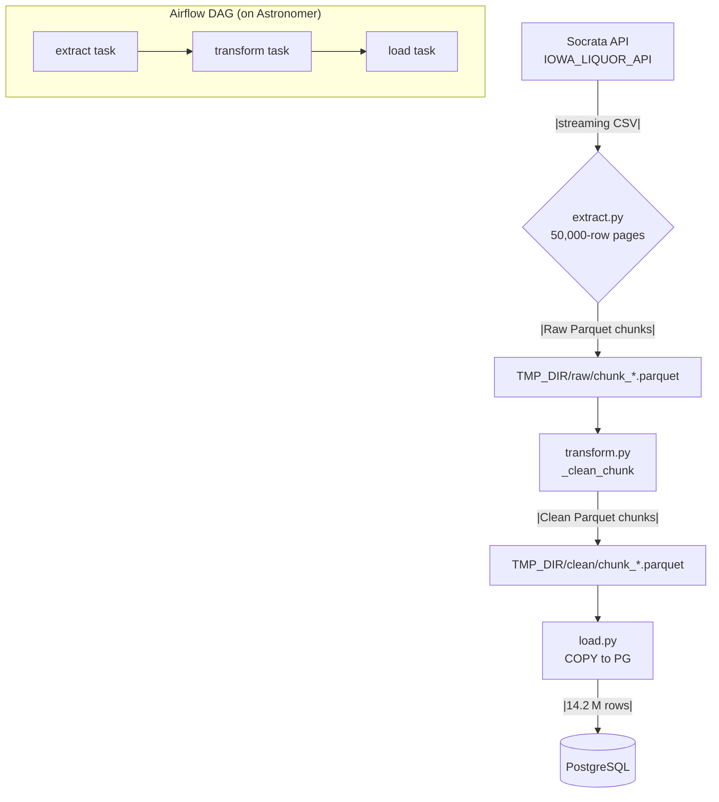

# Iowa Liquor Sales ETL Pipeline

A fully‑automated, streaming Extract–Transform–Load (ETL) workflow that ingests the **Iowa Liquor Sales** open dataset (14 M+ rows, \~6 GB), cleans it chunk‑by‑chunk, and loads it efficiently into PostgreSQL. The entire pipeline is orchestrated using Apache Airflow, running on the Astronomer platform.

## Contents

- [Architecture](#architecture)
- [Key Design Points](#key-design-points)
- [Project Layout](#project-layout)
- [ETL Pipeline](#etl-pipeline)
- [Schema Extension for Analytical Star Schema](#schema-extension-for-analytical-star-schema)
- [Performance Notes](#performance-notes)

## Architecture

The ETL process is orchestrated by an Apache Airflow DAG running on the Astronomer platform. The DAG defines three sequential tasks: `extract`, `transform`, and `load`. Each task executes a corresponding Python script from the `src/` directory.



## Key Design Points

The pipeline was designed with the following considerations:

| Concern            | Approach                                                                          |
| ------------------ | --------------------------------------------------------------------------------- |
| _Scalability_      | Stream‐fetch via `$offset` paging; never holds the full dataset in memory.        |
| _Memory footprint_ | Processes fixed‑size chunks (default = 50 000).                                   |
| _Throughput_       | Uses `pandas.to_parquet()` + `pyarrow` for columnar I/O; `COPY` for PG bulk load. |
| _Reproducibility_  | Deterministic chunks; all parameters in a single `src/config.py`.              |
| _Observability_    | Airflow logs + per‑stage progress counters (rows / chunks).                       |

## Project Layout

The project is organized into the following structure:

```
.
├── dags/                     # Airflow DAGs
│   └── iowa_liquor_dag.py
├── include/sql/              # DDL & SQL helpers
│   └── create_table.sql
├── src/                      # Pure‑Python ETL library
│   ├── config.py             # Env var ingestion & tunables
│   ├── extract.py            # Streaming downloader → Parquet
│   ├── transform.py          # Per‑chunk cleaners
│   └── load.py               # COPY loader into PostgreSQL
├── tests/                    # Pytest unit tests
│   ├── test_extract.py
│   ├── test_transform.py
│   └── test_load.py
├── Dockerfile                # Dockerfile for Astronomer runtime
├── requirements.txt          # Python dependencies
└── README.md
```

## ETL Pipeline

The ETL pipeline consists of three main stages, each implemented as a Python module in the `src/` directory and orchestrated by an Airflow DAG. Configuration for the pipeline (API endpoints, database credentials, chunk size) is managed in `src/config.py` and can be overridden using environment variables, which are set in the Astronomer UI.

| Stage           | File / Function(s)                        | Highlights                                                                                                  |
| --------------- | ----------------------------------------- | ----------------------------------------------------------------------------------------------------------- |
| **Extract**     | `src/extract.py` → `extract_to_parquet()` | • Streams pages with `$limit`+`$offset`.<br>• Writes `chunk_<n>.parquet` (columnar, compressed).            |
| **Transform**   | `src/transform.py` → `_clean_chunk()`     | • Enforces `datetime64[ns]` on `date` column.<br>• Performs numeric coercion & `NaN→0` for sales metrics.   |
| **Load**        | `src/load.py` → `copy_parquet_chunks()`   | • Streams each chunk through an in‑memory CSV buffer.<br>• Executes `COPY … FROM STDIN` (≈1.2 M rows/min).  |
| **Orchestrate** | `dags/iowa_liquor_dag.py`                 | • Three `PythonOperator`s wired `extract → transform → load`.<br>• The DAG is configured for manual trigger. |

## Schema Extension for Analytical Star Schema

Here’s a high‑level narrative of how the analytical star schema was created and populated:

1. **Designed a Star Schema**: The single, wide sales table was decomposed into one **fact table** (recording each invoice‑line’s numeric sales measures) and five **dimension tables** (storing descriptive attributes for Store, Date, Item, Vendor, and Category). This arrangement supports flexible slicing and dicing of sales data by any combination of dimensions, following industry‑standard data warehousing practices.

2. **Created Dimension Tables**: Each business entity—stores, calendar dates, liquor items, vendors, and categories—was given its own table. The primary key in each dimension is the original code or date. Only the necessary descriptive attributes were retained (for example, store code plus name, address, city, zip, county; or date plus year, quarter, month, day‑of‑week, and weekend flag).

3. **Created the Fact Table**: The fact table uses the original invoice‑line number as its primary key and includes foreign‑key columns referencing each dimension. Alongside these keys are the quantitative measures (bottles sold, sales dollars, liters, and gallons) for each transaction line. Foreign‑key constraints ensure referential integrity between facts and dimensions.

4. **Upserted Dimension Data**: To load each dimension from the raw table, every distinct key‑attribute combination was selected. Null keys were filtered out to satisfy NOT NULL constraints. An “upsert” pattern (`INSERT ... ON CONFLICT DO NOTHING`) was used so that new dimension rows could be added safely without failing on duplicates, allowing the process to be re‑run as new codes appear over time.

5. **Loaded the Fact Table**: With dimensions in place, all invoice lines were loaded into the fact table. Timestamps were truncated to dates to match the date dimension. The invoice‑line ID was ensured non‑null, and the same `ON CONFLICT DO NOTHING` approach prevented duplicate loads, making the process idempotent for incremental updates.

6. **Resulting Structure**:

   - Dimension tables now hold clean, deduplicated master lists of stores, dates, items, vendors, and categories.
   - The fact table links these dimensions at the transaction level, storing all numeric sales measures.
   - Referential integrity is enforced via foreign‑key constraints.
   - The upsert approach makes the pipeline safe to run repeatedly without manual de‑duplication.

## Performance Notes

- **Chunk size** (`CHUNK_ROWS`) – 50 000 rows was empirically the sweet spot between API latency & PG COPY buffer size.
- **I/O** – Parquet/Arrow yields \~4× smaller on‑disk size vs CSV and avoids parser cost on reload.
- **Parallelism** – The Airflow tasks are serial by design to keep memory bounded, but the pipeline is embarrassingly parallel if you shard the date range.
