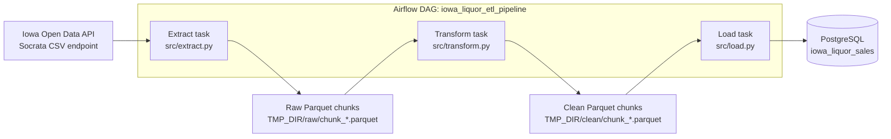

# Iowa Liquor Sales ETL Pipeline

A manually triggered Apache Airflow pipeline (Astronomer runtime) that extracts Iowa Liquor Sales data in chunks, transforms it via Parquet intermediates, and bulk-loads it into PostgreSQL using COPY.

## Executive Overview

This repository implements a practical ETL system for a large public dataset from Iowa's Socrata endpoint.

- Orchestration is done with a single Airflow DAG containing three sequential Python tasks: extract, transform, and load.
- Extraction is page-based and chunked to avoid loading the full dataset into memory.
- Transformation is stateless and chunk-wise, with explicit typing and numeric coercion.
- Loading uses PostgreSQL COPY for high-throughput ingest.
- Execution artifacts are tracked in-repo and provide verifiable evidence of an end-to-end run.

## Architecture and End-to-End Data Flow


```mermaid
flowchart LR
     A[Iowa Open Data API\nSocrata CSV endpoint]
     B[Extract task\nsrc/extract.py]
     C[Raw Parquet chunks\nTMP_DIR/raw/chunk_*.parquet]
     D[Transform task\nsrc/transform.py]
     E[Clean Parquet chunks\nTMP_DIR/clean/chunk_*.parquet]
     F[Load task\nsrc/load.py]
     G[(PostgreSQL\niowa_liquor_sales)]

     A --> B --> C --> D --> E --> F --> G

     subgraph Airflow DAG: iowa_liquor_etl_pipeline
        B
        D
        F
     end
```

### Runtime Flow

1. Airflow triggers `extract_task`.
2. `src/extract.py` requests Socrata pages with `$limit` and `$offset`, writing each page as `chunk_XXXXX.parquet`.
3. Airflow passes chunk paths via XCom (as strings for JSON serialization).
4. `src/transform.py` reads each raw chunk, applies column-level cleaning, and writes cleaned Parquet chunks.
5. `src/load.py` creates the target table (if needed), streams each chunk into an in-memory CSV buffer, and loads via `COPY ... FROM STDIN`.

## Repository Structure

```text
.
├── .astro/
│   ├── config.yaml
│   ├── dag_integrity_exceptions.txt
│   └── test_dag_integrity_default.py
├── dags/
│   └── iowa_liquor_dag.py
├── include/
│   └── sql/
│       └── create_table.sql
├── logs/
│   └── extract.log
├── plugins/
│   └── __init__.py
├── src/
│   ├── __init__.py
│   ├── config.py
│   ├── extract.py
│   ├── transform.py
│   └── load.py
├── tests/
│   ├── test_extract.py
│   ├── test_transform.py
│   └── test_load.py
├── task_extract.log
├── task_transform.log
├── task_load.log
├── dag_logs.log
├── airflow_settings.yaml
├── Dockerfile
├── requirements.txt
├── IowaLiquor-RDS.session.sql
└── README.md
```

## Dataset Source and Chunking Strategy

### Dataset Source

- Source: Iowa Open Data (Socrata CSV endpoint), configured through `IOWA_LIQUOR_API`.
- Query pattern in `src/extract.py`:
  - `$select=*`
  - `$where=date BETWEEN '<start>T00:00:00' AND '<end>T23:59:59'`
  - `$limit=CHUNK_ROWS`
  - `$offset=<running row offset>`

### Chunking Strategy

- Chunk size is configurable through `CHUNK_ROWS` (default `50000` in `src/config.py`).
- Extract loop terminates only when an empty page is returned.
- Chunks are deterministically named as `chunk_00000.parquet`, `chunk_00001.parquet`, etc.
- The final chunk can be partial; tracked logs show the last extract chunk had `45,703` rows.

Why this exists:

- Keeps memory bounded.
- Enables inspectable intermediate artifacts and easier stage-level debugging.
- Provides predictable batch boundaries for transform and load stages.

## Major Features: What and Why

| Feature | What It Does | Why It Exists | Implemented In |
|---|---|---|---|
| Manual DAG orchestration | Runs ETL as three ordered tasks (`extract >> transform >> load`) | Explicit operator control for ad hoc backfills and controlled runs | `dags/iowa_liquor_dag.py` |
| Chunked extraction | Pulls data page-by-page using Socrata `$limit/$offset` | Prevents full-dataset memory pressure and supports large ingest | `src/extract.py` |
| Parquet intermediates | Writes raw and cleaned chunks to Parquet | Efficient columnar I/O between ETL stages | `src/extract.py`, `src/transform.py` |
| Stateless transform layer | Cleans each chunk independently (datetime parsing, numeric coercion) | Keeps transformation deterministic and composable | `src/transform.py` |
| COPY-based bulk loading | Streams chunk data to Postgres using `copy_expert` | Higher ingest throughput than row-by-row inserts | `src/load.py` |
| SQL-managed table creation | Executes `create_table.sql` before loading | Ensures target schema exists before COPY | `src/load.py`, `include/sql/create_table.sql` |
| Centralized config handling | Loads environment-driven settings once | Keeps runtime configuration explicit and portable | `src/config.py` |

## Implementation Details

### Apache Airflow

- DAG ID: `iowa_liquor_etl_pipeline`
- Schedule: `schedule=None` (manual trigger only)
- Catchup: `False`
- Retry policy: `retries=1`, `retry_delay=5 minutes`
- Task exchange: chunk file paths passed via XCom as strings (not `Path` objects) for JSON serialization compatibility.

### Astronomer

- Runtime image is pinned in `Dockerfile` as `astrocrpublic.azurecr.io/runtime:3.0-4`.
- Python dependencies are pinned in `requirements.txt` (Airflow provider packages, pandas, pyarrow, psycopg2, requests, pytest).
- Astro project metadata exists in `.astro/config.yaml`.
- `.astro/test_dag_integrity_default.py` is present for DAG import integrity checks in Astro workflows.

### Parquet Intermediates

- Extract stage writes raw chunks to `TMP_DIR/raw`.
- Transform stage reads raw chunks and writes cleaned chunks to `TMP_DIR/clean`.
- Both operations use pandas + pyarrow-backed parquet read/write APIs.

### PostgreSQL COPY Loading

- Connection is established with `psycopg2` using environment variables.
- Data is converted chunk-wise to CSV in-memory (`io.BytesIO`) and loaded with `COPY ... FROM STDIN`.
- Nulls are represented as `\N` during COPY.
- Target table DDL is read from `include/sql/create_table.sql` and executed before ingest.

### Configuration Handling

- `.env` values are loaded by `python-dotenv` in `src/config.py`.
- Typed parsing is applied where needed (`POSTGRES_PORT`, `CHUNK_ROWS`).
- `TMP_DIR` defaults to `/tmp/iowa_liquor_etl` and is created on startup.
- Date boundaries for extraction are currently hardcoded in the DAG (`START_DATE`, `END_DATE`).

## Problems Faced and What Was Solved

This section is grounded in implementation and tracked logs.

1. Large-volume ingestion without exhausting memory.
    - Problem: Full-table extraction is too large for a single in-memory dataframe workflow.
    - Solution in repo: Strict chunked extraction and chunk-wise processing through all stages.

2. Airflow task handoff for filesystem objects.
    - Problem: `Path` objects are not JSON-serializable for XCom payloads.
    - Solution in repo: Convert chunk paths to strings when returning from tasks and cast back to `Path` in downstream tasks.

3. Load performance for multi-million-row ingest.
    - Problem: Row-wise inserts are too slow for this volume.
    - Solution in repo: PostgreSQL COPY from in-memory CSV buffers.

4. Pipeline robustness for transient failures.
    - Problem: Network/API operations may intermittently fail.
    - Solution in repo: Airflow retries are enabled (`retries=1`); tracked extract run evidence shows `try_number=2`.

5. Operational evidence preservation.
    - Problem: Without persisted task output, run claims are hard to verify.
    - Solution in repo: Task logs are tracked (`task_extract.log`, `task_transform.log`, `task_load.log`, `dag_logs.log`).

## Setup and Run Instructions

### Prerequisites

- Docker Desktop
- Astronomer CLI (`astro`)
- A reachable PostgreSQL instance

### 1) Clone and enter the project

```bash
git clone https://github.com/sundar139/IOWA-Liquor-Sales.git
cd IOWA-Liquor-Sales
```

### 2) Configure environment variables

Create `.env` from `.env.example` and provide valid values:

```env
IOWA_LIQUOR_API=...
POSTGRES_HOST=...
POSTGRES_PORT=5432
POSTGRES_DB=...
POSTGRES_USER=...
POSTGRES_PASSWORD=...
CHUNK_ROWS=50000
TMP_DIR=/tmp/iowa_liquor_etl
```

### 3) Start Astronomer local runtime

```bash
astro dev start
```

### 4) Trigger the DAG manually

Option A: Airflow UI

- Open `http://localhost:8080`
- Find DAG `iowa_liquor_etl_pipeline`
- Trigger run manually

Option B: Astro CLI

```bash
astro dev run dags trigger iowa_liquor_etl_pipeline
```

### 5) Inspect task outcomes

- In Airflow task logs, or
- In tracked artifacts included in this repo (`task_extract.log`, `task_transform.log`, `task_load.log`).

## Configuration Reference

| Key | Required | Default | Purpose |
|---|---|---|---|
| `IOWA_LIQUOR_API` | Yes | None | Socrata CSV endpoint used by extractor |
| `POSTGRES_HOST` | Yes | None | Postgres host |
| `POSTGRES_PORT` | No | `5432` | Postgres port |
| `POSTGRES_DB` | Yes | None | Database name |
| `POSTGRES_USER` | Yes | None | Database user |
| `POSTGRES_PASSWORD` | Yes | None | Database password |
| `CHUNK_ROWS` | No | `50000` | Page/chunk row size for extraction |
| `TMP_DIR` | No | `/tmp/iowa_liquor_etl` | Intermediate parquet workspace |

Additional DAG-level controls (currently hardcoded):

- `START_DATE = "2020-01-01"`
- `END_DATE = "2025-06-30"`

## Results and Evidence

The following results are directly supported by tracked artifacts in this repository.

### Verified execution evidence

- `task_extract.log`: `✔ extracted 14,245,703 rows in 285 chunks`
- `task_transform.log`: `✔ transformed 285 chunks`
- `task_load.log`: `COPY 285/285  +45,703 rows  (cum 14,245,703)`
- `task_load.log`: `✔ loaded 14,245,703 rows in 749.9s`
- Manual trigger evidence appears in task logs with run ID:
  - `manual__2025-07-11T04:54:25.401038+00:00`

## Evaluation and Validation

### What is verified by repository artifacts

- End-to-end run execution across extract, transform, and load tasks.
- Row and chunk counts for extract and load stages.
- End-to-end load duration from task log output.
- Manual-trigger DAG run context and task-level execution metadata.

### What is implemented by architecture but not independently validated in tracked artifacts

- Data quality scope beyond current coercions (for example, domain-level validation rules).
- Cross-run performance comparisons under varying chunk sizes or date windows.
- Operational behavior under repeat runs against an already-populated target table.
- Full automated test reliability for current function interfaces.

## Limitations

- Extraction date window is hardcoded in DAG source, not parameterized through DAG run config.
- Load path writes directly to target table with primary key constraints; repeat loads of overlapping data can conflict.
- Current repository artifacts demonstrate one tracked successful run, not a longitudinal reliability history.
- Test files in `tests/` reference function names that do not match current implementations in `src/` and need alignment.
- The exact Socrata endpoint ID is environment-driven (`IOWA_LIQUOR_API`) and must be explicitly controlled by deployment configuration.

## Conclusion

This project demonstrates a clear, production-style ETL pattern for large public datasets using Airflow + Astronomer + PostgreSQL: chunked extraction, parquet-mediated transformation, and COPY-based loading. Its strongest quality is that execution claims are backed by tracked task artifacts rather than narrative-only descriptions.

## Future Improvements

1. Parameterize extraction boundaries (`START_DATE`, `END_DATE`) via DAG run config or Airflow variables.
2. Introduce an idempotent load strategy for reruns (for example, staging + merge/upsert workflow).
3. Align and modernize `tests/` to match current ETL function signatures and add integration coverage.
4. Add structured run summaries (per-stage row counts, duration, and failures) as machine-readable artifacts.
5. Pin and document one recommended Socrata endpoint ID in environment templates and deployment docs.

## License

This project is licensed under the MIT License. See the [LICENSE](./LICENSE) file for details.
